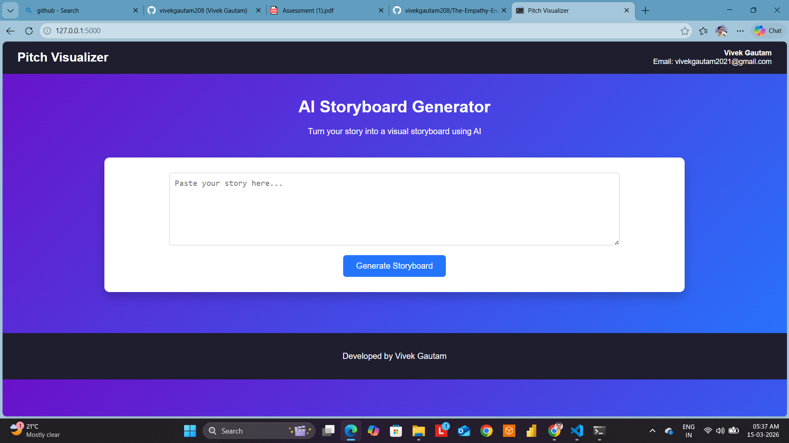
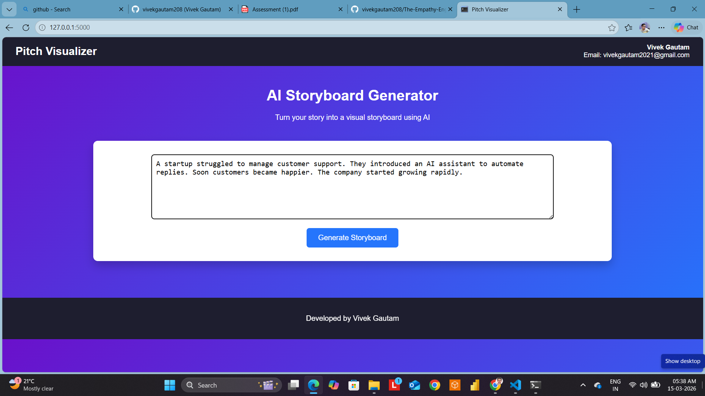
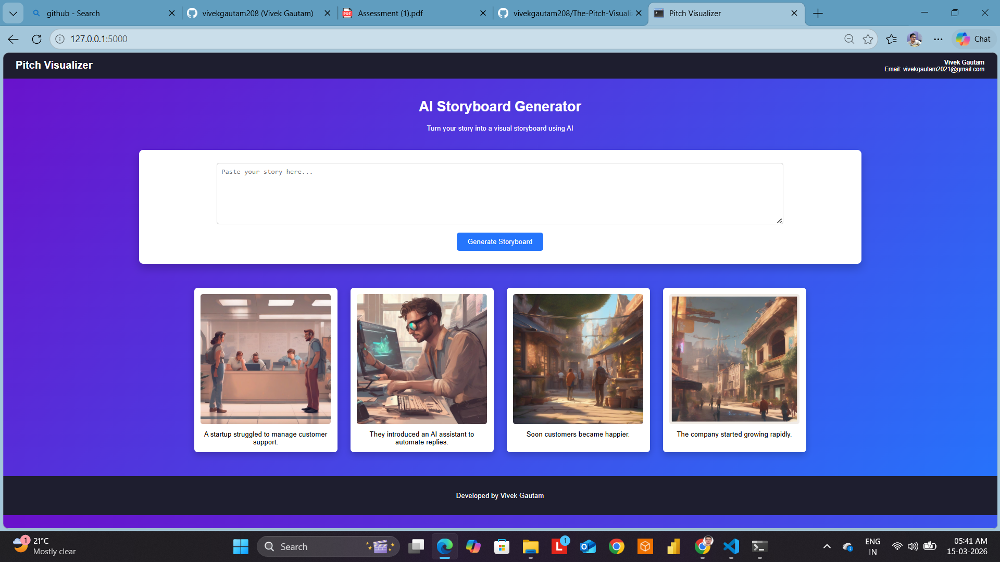

# Pitch Visualizer – From Words to Storyboard

## 1. Project Description

**Pitch Visualizer** is an AI-powered web application that converts a narrative story into a **visual storyboard**. The goal of this project is to help users transform plain text into a sequence of images that visually represent the key moments of the story.

The system takes a paragraph as input, automatically breaks it into meaningful scenes, generates descriptive prompts, and produces images for each scene using an AI image generation model. The final output is displayed as a **multi-panel storyboard** where each panel contains an image and the corresponding text segment.
Project Screenshots

Below are some screenshots demonstrating the working of the Empathy Engine web interface.

1. Application Interface




2. Text Input and Emotion Detection




3. Generated Voice Output


This tool can be useful for:

* Sales teams preparing visual presentations
* Content creators designing storyboards
* Students learning storytelling and visualization
* Marketing teams creating quick visual narratives

---

## 2. Technologies Used

### Programming Language

* **Python**

### Backend Framework

* **Flask** – used to build the web application and handle user requests.

### Natural Language Processing

* **NLTK (Natural Language Toolkit)** – used for sentence tokenization to break the story into individual scenes.

### Image Generation

* **AI Image Generation API (Hugging Face / Pollinations)** – used to generate images from text prompts.

### Frontend

* **HTML**
* **CSS**
* **Jinja2 Template Engine** (used by Flask to render dynamic content)

### Additional Libraries

* **requests** – used for sending API requests to the image generation model.
* **urllib.parse** – used to encode prompts for URL-based image generation.

---

## 3. System Workflow

The system works in the following steps:

1. **User Input**
   The user enters a short story (3–5 sentences) into the text area.

2. **Narrative Segmentation**
   The application uses NLTK to split the paragraph into individual sentences.

3. **Prompt Engineering**
   Each sentence is converted into a detailed visual prompt to guide the image generation model.

4. **Image Generation**
   The prompt is sent to the AI image generation API to generate a scene image.

5. **Storyboard Rendering**
   The generated images are displayed with captions in a storyboard layout.

---

## 4. Setup Instructions

### Step 1 – Clone the Repository

```bash
git clone https://github.com/your-username/pitch-visualizer.git
cd pitch-visualizer
```

---

### Step 2 – Install Required Libraries

Install the dependencies using pip:

```bash
pip install flask nltk requests
```

---

### Step 3 – Download NLTK Tokenizer

Run the following command once:

```python
import nltk
nltk.download('punkt')
```

---

### Step 4 – API Key Setup (If Using Hugging Face)

1. Go to the Hugging Face token page:
   https://huggingface.co/settings/tokens

2. Create a new token.

3. Replace the API key inside the code:

```python
API_KEY = "your_api_token_here"
```

If you are using Pollinations image generation, an API key is **not required**.

---

## 5. Running the Application

Run the Flask application:

```bash
python app.py
```

Then open the browser and go to:

```
http://127.0.0.1:5000
```

---

## 6. Example Input

Example story:

```
A startup struggled to manage customer support.
They introduced an AI assistant to automate replies.
Soon customers became happier.
The company started growing rapidly.
```

---

## 7. Output

The application generates a **visual storyboard**:

Panel 1 → Scene showing startup struggling
Panel 2 → Scene showing AI assistant helping
Panel 3 → Scene showing happy customers
Panel 4 → Scene showing business growth

Each panel contains:

* An AI-generated image
* The corresponding story sentence

---

## 8. Prompt Engineering Methodology

Prompt engineering is an important part of this system because raw sentences may not produce visually rich images.

To improve image quality, each sentence is enhanced with descriptive keywords such as:

* *cinematic digital illustration*
* *storytelling scene*
* *detailed concept art*
* *vibrant lighting*

Example:

Original sentence:

```
A startup struggled to manage customer support.
```

Enhanced prompt:

```
cinematic digital illustration, storytelling scene, detailed concept art, a startup team struggling to manage customer support in a modern office
```

This helps the image generation model create clearer and more visually meaningful images.

---

## 9. Design Choices

Several design decisions were made while building the project:

**1. Flask Framework**
Flask was chosen because it is lightweight and easy to use for building quick web applications.

**2. Sentence-Based Segmentation**
Breaking the narrative into sentences ensures that each sentence becomes a separate storyboard panel.

**3. Prompt Enhancement**
Adding artistic keywords improves the visual quality of generated images.

**4. Storyboard Layout**
A card-based panel layout was used so that each scene appears clearly separated and easy to read.

---

## 10. Future Improvements

Possible future improvements include:

* Allowing users to select **different artistic styles**
* Adding **character consistency across scenes**
* Using an **LLM for advanced prompt generation**
* Exporting the storyboard as **PDF or slides**
* Adding **animations and transitions**

---

## 11. Author

**Vivek Gautam**

Pitch Visualizer Project
